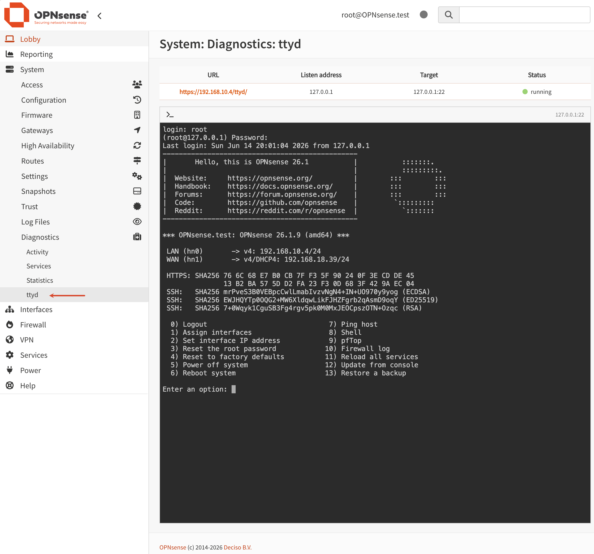

# ttyd for OPNsense

This project adds a ttyd browser terminal to OPNsense under:

```text
System > Diagnostics > ttyd
```

The web terminal starts a real TTY through `ttyd`, then prompts for a login name and connects to the local firewall through SSH:

```sh
printf "login: "; read -r user; ssh -tt "$user@127.0.0.1"
```

Authentication, permissions, auditing, and the shell environment remain controlled by OPNsense OpenSSH. 

Tested and verified in the following environments:

- OPNsense 26.1.9



## Compatibility

The installer targets OPNsense on FreeBSD 14 amd64. It first uses the bundled FreeBSD 14 amd64 packages under `vendor/freebsd14-amd64`, then tries the configured OPNsense package repositories, then falls back to the official FreeBSD 14 amd64 quarterly repository for `libwebsockets` and `ttyd`.

## Files

- `src/usr/local/www/diag_ttyd.php`: OPNsense web page.
- `src/usr/local/etc/lighttpd_webgui/conf.d/ttyd.conf`: same-origin reverse proxy for the embedded terminal.
- `src/usr/local/opnsense/mvc/app/models/OPNsense/Ttyd/Menu/Menu.xml`: OPNsense menu entry.
- `src/usr/local/opnsense/mvc/app/models/OPNsense/Ttyd/ACL/ACL.xml`: OPNsense page ACL entry.
- `src/usr/local/opnsense/service/conf/actions.d/actions_ttyd.conf`: configd service actions.
- `src/usr/local/etc/rc.d/os-ttyd`: rc.d service script.
- `src/etc/rc.conf.d/ttyd`: default service configuration.
- `vendor/freebsd14-amd64/*.pkg`: bundled FreeBSD 14 amd64 ttyd runtime packages.
- `build.sh`: builds `dist/os-ttyd.pkg` on FreeBSD/OPNsense. The package uses a private runtime under `/usr/local/os-ttyd`.

## Install

From an OPNsense shell, enter this project directory and run:

```sh
pkg add -f os-ttyd.pkg
```

Refresh the OPNsense web interface and open `System > Diagnostics > ttyd`.

## Uninstall

```sh
pkg delete os-ttyd
```
## Requirements

1. Enable Secure Shell under `System > Settings > Administration`.
2. Allow the management workstation to reach the ttyd HTTPS/WebSocket port. The default port is `7681`.
3. Bind ttyd to a trusted management/LAN address when possible. Do not expose it to WAN.

## Usage

Open `System > Diagnostics > ttyd`. The page embeds the terminal through the OPNsense WebGUI path:

```text
https://<OPNsense-address>/ttyd/
```

The terminal first displays `login:`. Enter the OPNsense SSH username, then enter the SSH password or key passphrase when prompted.

## Configuration

The SSH target is fixed to:

```text
127.0.0.1:22
```

The default ttyd listen address is `127.0.0.1`, and the default backend port is `7681`. OPNsense lighttpd proxies `/ttyd/` to that local backend. Edit `src/etc/rc.conf.d/ttyd` before installation, or `/etc/rc.conf.d/ttyd` after installation, then restart the service:

```sh
service os-ttyd restart
```

## Security Notes

- Do not expose the ttyd listener to WAN.
- Use strong OPNsense administrator credentials or SSH keys.
- Remove the project or restrict management access when the terminal is not needed.
